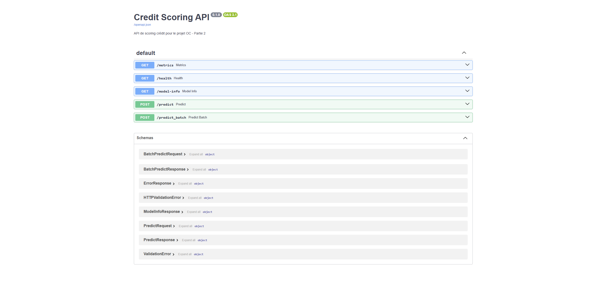
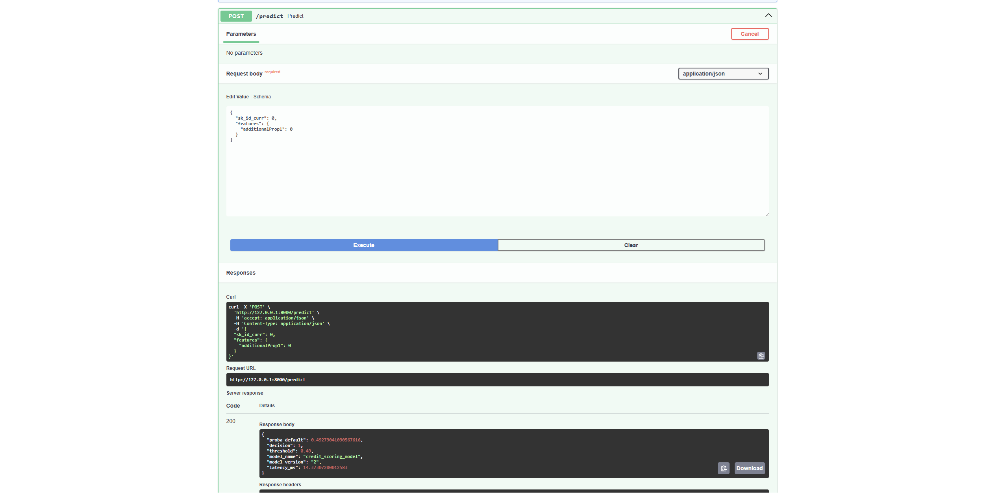
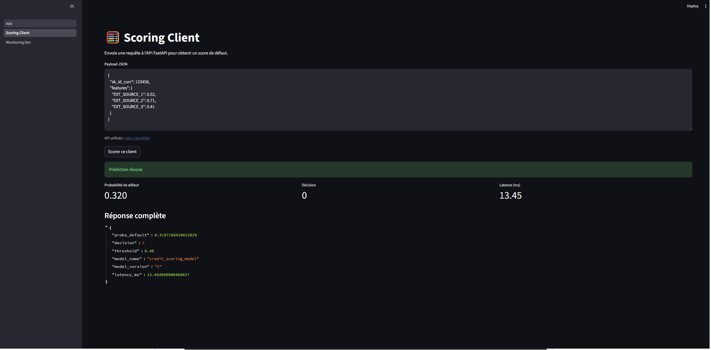
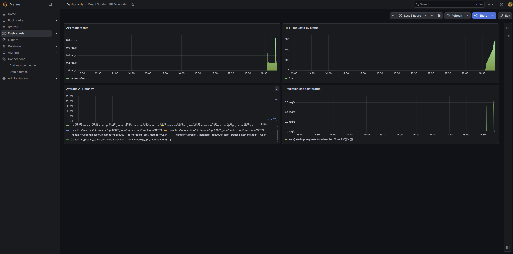
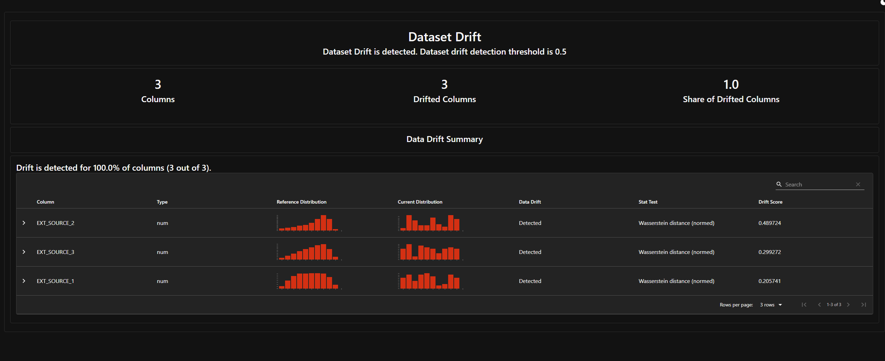
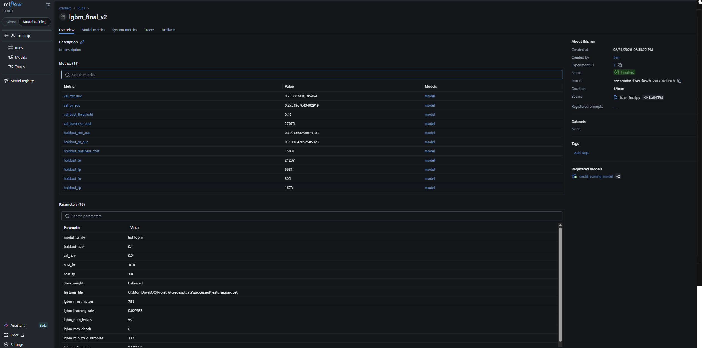

# Credit Scoring MLOps

A credit default model served behind an API, with its predictions stored, its traffic
monitored, its drift watched — and, more unusually, its **decision analysed**: how honest
the published cost is, how uncertain, how much it depends on an assumption nobody
measured, and how it falls across age and gender.

## Project status

**This repository is archived in a runnable state.** The Hugging Face Space, the Supabase
database and the API keys have been decommissioned, and the continuous integration
workflows are frozen to manual trigger only — deliberately, so that nothing here decays
into a red cross on an unmaintained project. Their last successful runs stay visible in
the Actions tab.

The trained model is versioned, so everything below reproduces locally with
`docker compose up`. The one thing not shipped is the data: Home Credit's terms do not
allow redistribution. See [Reproducing the results](#reproducing-the-results).

## The problem

A lender approving a loan makes an asymmetric mistake. Refusing a good applicant costs a
margin. Approving one who defaults costs the principal. Treating the two as equally bad —
which is what a 0.5 threshold on a probability does — optimises for a cost nobody has.

This project scores [Home Credit Default Risk](https://www.kaggle.com/c/home-credit-default-risk)
applicants and picks its decision threshold by minimising a business cost where a false
negative is worth ten false positives, then puts the whole thing behind an API with the
monitoring a served model needs.

## What it does



Send an applicant, get a probability, a decision at the shipped threshold, and the
reasoning behind it. Every prediction is written to Postgres, so the served population can
be compared later against the training one.



A Streamlit interface sits on top for people who will not send JSON by hand, with a
scoring page and a monitoring page.



Prometheus scrapes the API and Grafana draws it: request rate, status codes, latency, and
traffic on the prediction endpoint specifically.



## Approach

Ingestion joins the seven Home Credit tables into one feature set. Training is
cross-validated with stratified folds, tracked in MLflow, and tuned with Optuna; the
selected model is a LightGBM. The decision threshold is chosen by minimising the business
cost, not by taking 0.5. Serving loads a frozen `pipeline.joblib` with its
`feature_columns.json` and `threshold.json`, so the API depends on artefacts rather than
on the training code.

Two choices worth defending:

**The preprocessing lives inside the pipeline, not before it.** Imputation and scaling are
steps of the `Pipeline` that is fit on the training fold, so nothing about the validation
fold reaches the transformer. It is the most common leak on this dataset and the reason
published scores on it are often optimistic.

**A frozen artefact, not a model registry call, backs the API.** MLflow tracks the
experiments; it does not sit in the serving path. One fewer service to keep alive for a
model that is not retrained on a schedule.

**The artefact carries a manifest.** `model_manifest.json` is written by the final
training and read by the loader: the feature columns and their schema version, the
threshold and how it was chosen, the hyperparameters and the tuning trial they came from,
the imbalance strategy, a fingerprint of the training data, and the commit. The
hyperparameters used to be copied into the training script by hand from a previous Optuna
run, which meant the final model depended on a result no file connected it to. They are
now read from the tracked trials, and a missing tuning artefact stops the training instead
of letting it invent them.

### Where leakage would come from, and why it does not

The aggregations are the usual risk on this dataset, and they are safe here for a specific
reason: every one is computed **per customer over their own history**, keyed on
`SK_ID_CURR`, from tables that record what happened before the application. No aggregate
is computed across customers, and none reaches forward in time.

The two places that would need care if this were extended:

- **A feature built from an outcome.** Nothing here touches `TARGET` outside the label
  itself, but a "number of previous defaults" aggregate drawn from the wrong table would,
  and it would look like an ordinary count.
- **Preprocessing fit outside the fold.** Handled by construction — imputation and scaling
  are steps of the `Pipeline`, so they are fit on the training fold only — and it is worth
  naming, because it is the leak that most often survives a review on this dataset.

The check that would catch a regression is not a test but a smell: a single feature whose
importance dwarfs every other. None does here.

## The decision analysis

This is the part that distinguishes a model from a decision, and it is where I would start
reading.

### Is the model worth having?

| Policy | Cost per applicant |
|---|---|
| accept everyone | 0.8075 |
| refuse everyone | 0.9193 |
| random at the base rate | 0.8170 |
| **the model, at threshold 0.49** | **0.4888** |

With 8 % defaults and a false negative worth ten false positives, refusing everyone is not
an absurd policy — which is exactly why it belongs in the table. The model roughly halves
the cost of the best trivial rule. Without these floors, `0.4888` has no scale.

### How uncertain is that number?

**95 % confidence interval: 0.4721 – 0.5068**, from 1 000 bootstrap resamples of the
holdout at a fixed threshold. The threshold is held fixed on purpose: resampling *and*
re-optimising would mix two sources of variation into an interval nobody could interpret.

### Is it honest?

Two biases were suspected, and both were measured rather than argued about.

The cross-validation used to pick its threshold on the same fold it then scored. On the
holdout, that shortcut is worth **0.0029 per applicant** — about 0.6 % of the cost. Real,
small, and free to remove, which is what happened: each fold is now scored with the
threshold its neighbour chose.

The shipped threshold was calibrated on a model trained on part of the development set and
then applied to one refit on all of it. Against this sample's own optimum (0.48 rather than
0.49) the **regret is 0.0028 per applicant**. The compromise is validated by measurement,
not by assertion.

### How much rests on an assumption?


The optimal threshold runs from **0.89** if a false negative is worth one false positive to
**0.18** if it is worth fifty. The decision sweeps the entire usable range on the strength
of a ratio that was assumed, not measured. Everything above is conditional on that number,
and this figure is how a reader sees it.

### Who does it refuse?

| Group | n | Default rate | Refusal rate | Missed defaulters |
|---|---|---|---|---|
| under 30 | 4 349 | 0.112 | **0.484** | 0.211 |
| 30-39 | 8 144 | 0.093 | 0.340 | 0.254 |
| 40-49 | 7 773 | 0.078 | 0.258 | 0.327 |
| 50-59 | 6 844 | 0.065 | 0.194 | 0.457 |
| 60 and over | 3 641 | 0.051 | **0.125** | **0.587** |
| men | 10 371 | 0.103 | 0.378 | 0.243 |
| women | 20 380 | 0.069 | 0.232 | 0.386 |

Applicants under thirty are refused **3.9 times** more often than those over sixty. Part of
that follows real risk — they default at 11.2 % against 5.1 %. Not all of it does, and the
mirror image is the uncomfortable half: among applicants over sixty the model **misses 59 %
of those who default**. Low refusal and poor detection are the same fact seen twice.

Nothing here is corrected. Adjusting a credit model for fairness commits to a definition of
fairness, and several reasonable definitions are mutually exclusive — equal refusal rates
and equal error rates cannot both hold when the base rates differ. That is a decision for
whoever owns the lending policy, and taking it in passing would be worse than naming it.

Reproduce all of it with `uv run python scripts/decision_analysis.py`; the numbers land in
`reports/decision/`.

## Limitations, and what I would do differently

**The cost ratio is assumed, not measured.** Ten to one is plausible and conventional. It
is not evidence. The sensitivity curve exists because that assumption deserved a figure
rather than a footnote, but the right fix is to get the real ratio from whoever bears the
loss.

**One holdout, drawn once.** The confidence interval covers sampling noise inside that
holdout, not the variation between different splits. Repeated splits would widen it.

**The drift monitoring demonstrates tooling, not drift.** Home Credit has no usable time
axis, so what Evidently compares is two samples of the same population. The plumbing is
real; the phenomenon is not.



**The fairness gaps are published and untouched.** See above.

**Only the model is compared against trivial baselines.** A logistic regression and an
untuned LightGBM would round out the table, and both need retraining on the full feature
set — outside the "no retraining" boundary this analysis set for itself.

## Stack

Python 3.12 · LightGBM · scikit-learn · imbalanced-learn · Optuna · MLflow · FastAPI ·
Streamlit · PostgreSQL · Prometheus · Grafana · Evidently · pytest · ruff · bandit · uv ·
Docker.



## Reproducing the results

```bash
cp .env.example .env          # add the database and API settings
uv sync --all-groups
docker compose up             # API, Streamlit, Postgres, Prometheus, Grafana, MLflow
```

The API serves on `:8000` with its documentation at `/docs`; Streamlit on `:8501`.

The decision analysis needs the holdout, which is **not versioned** — Home Credit's terms
do not allow redistributing the data. Rebuild it from the raw tables with
`scripts/train_final.py`, then:

```bash
uv run python scripts/decision_analysis.py
```

Tests: `uv run pytest` — 23 tests, no network, coverage gate at 20 %.

## Repository layout

```
src/credexp/
├── data/         raw table loading and joins
├── modeling/     features, training, threshold, and the decision analysis
├── serving/      artefact loading and prediction
├── db/           prediction storage
└── monitoring/   drift computation
scripts/          thin entry points, one per operation
streamlit_app/    the scoring and monitoring interface
artifacts/models/ the frozen serving artefacts
reports/decision/ the decision analysis results and figures
deploy/           Hugging Face Space packaging
```

## Licence

Code under [MIT](LICENSE). The Home Credit Default Risk data is **not redistributed**: it
remains subject to the competition's terms and must be obtained from Kaggle.
