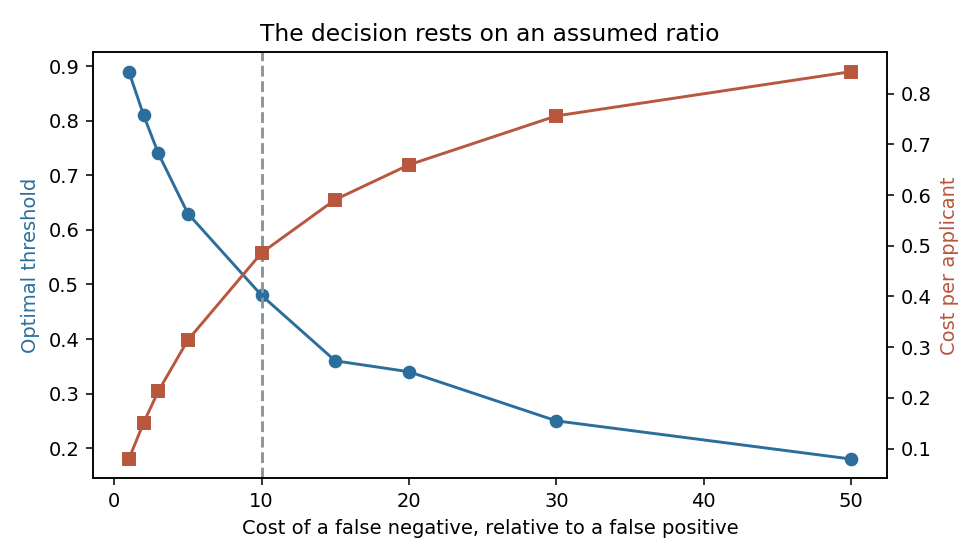
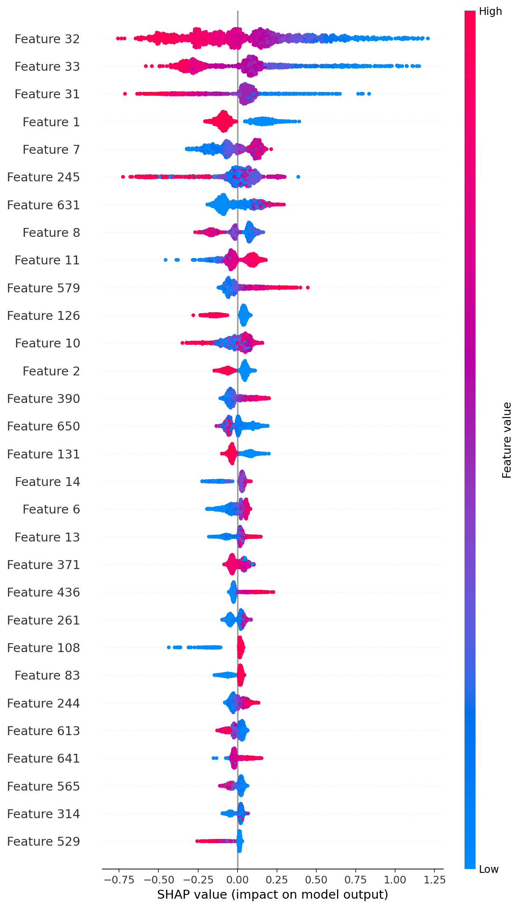
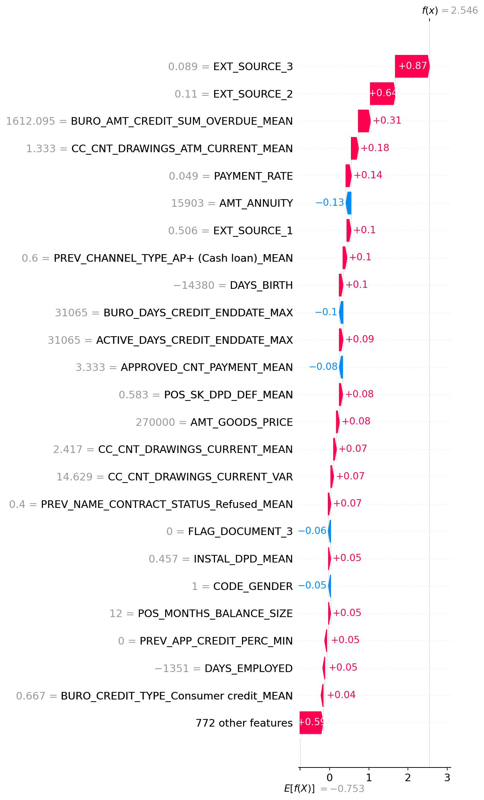

# Credit scoring

A model that estimates the probability a loan applicant defaults, served behind an API,
with the threshold that turns that probability into an accept-or-refuse decision chosen by
measurement rather than by convention.

**Project status** — finished, and archived in a runnable state. The hosted Space, the
managed database and the API keys have been decommissioned; everything below runs locally
with `docker compose up`, monitoring included. The one thing not shipped is the data: Home
Credit's terms do not allow redistribution. Continuous integration runs on push and on pull
requests.

## The problem

A lender approving a loan makes an asymmetric mistake. Refusing a good applicant costs a
margin. Approving one who defaults costs the principal. Treating the two as equally bad —
which is exactly what a 0.5 threshold on a probability does — optimises for a cost nobody
has.

The data is [Home Credit Default Risk](https://www.kaggle.com/c/home-credit-default-risk):
seven relational tables of loan applications and the applicants' credit history, joined
per customer. 8 % of them default.

So the model is the easy half. The question this repository is built around is **where to
put the threshold, and what happens to the answer when the assumption underneath it
moves.**

## What it does

An API scores an applicant and returns a probability, a decision at the shipped threshold,
and the threshold it used.


Every prediction is written to PostgreSQL — the payload, the score, the decision, the model
version, the latency — so the population being served can be compared later against the
population the model was fit on.


A Streamlit interface sits on top of it for people who will not send JSON by hand.


Its second page reads the log back: what has been decided lately, at what latency, and how
the threshold split the traffic.


Prometheus scrapes the API and Grafana draws it. Both the data source and the dashboard are
provisioned from `docker/grafana/`, so the dashboard is part of the repository rather than
of one person's browser.


### How it is built

Ingestion joins the seven tables into one feature set. Training is cross-validated with
stratified folds, tracked in MLflow, and tuned with Optuna; the selected model is a
LightGBM. Serving loads a frozen `pipeline.joblib` with its `feature_columns.json` and
`threshold.json`, so the API depends on artefacts rather than on the training code.

Three choices worth defending:

**Preprocessing lives inside the pipeline, not before it.** Imputation and scaling are
steps of the `Pipeline` fit on the training fold, so nothing about the validation fold
reaches the transformer. It is the most common leak on this dataset and the reason
published scores on it are often optimistic.

**A frozen artefact backs the API, not a registry call.** MLflow tracks the experiments; it
is not in the serving path. One fewer service to keep alive for a model that is not
retrained on a schedule.

**The artefact carries a manifest.** `model_manifest.json` is written by the final training
and read by the loader: the feature columns and their schema version, the threshold and how
it was chosen, the hyper-parameters and the tuning trial they came from, the imbalance
strategy, a fingerprint of the training data, and the commit. The hyper-parameters used to
be copied into the training script by hand from a previous Optuna run, which meant the
final model depended on a result no file connected it to. They are now read from the
tracked trials, and a missing tuning artefact stops the training instead of letting it
invent them.

## The result

The threshold is chosen by minimising an expected cost in which one default costs ten
times what one wrongly refused applicant costs. **The shipped value is 0.49**, and it
refuses 27 % of applicants.

A cost per applicant means nothing without something to compare it to, so the trivial
policies are in the table:

| Policy | Cost per applicant |
|---|---|
| refuse everyone | 0.9193 |
| random at the base rate | 0.8170 |
| accept everyone | 0.8075 |
| **the model, at threshold 0.49** | **0.4888** |

With 8 % defaults and a false negative worth ten false positives, refusing everyone is not
an absurd policy — which is exactly why it belongs there. The model roughly halves the cost
of the best trivial rule.

**95 % confidence interval on that cost: 0.4721 – 0.5068**, from 1 000 bootstrap resamples
of the holdout at a fixed threshold. The threshold is held fixed on purpose: resampling
*and* re-optimising would mix two sources of variation into an interval nobody could
interpret.

### What the whole thing rests on



Ten to one is an assumption. It was not measured, and the optimal threshold runs from
**0.89** if a default costs the same as a wrongful refusal to **0.18** if it costs fifty
times as much. The decision sweeps the entire usable range on the strength of that one
number.

This is the figure to look at before any other. Everything above is conditional on a ratio
that whoever bears the loss would have to supply, and the honest form of the result is
"0.4888 per applicant, *given* ten to one" rather than "0.4888 per applicant".

### Who it refuses

| Group | n | Default rate | Refusal rate | Missed defaulters |
|---|---|---|---|---|
| under 30 | 4 349 | 0.112 | **0.484** | 0.211 |
| 30-39 | 8 144 | 0.093 | 0.340 | 0.254 |
| 40-49 | 7 773 | 0.078 | 0.258 | 0.327 |
| 50-59 | 6 844 | 0.065 | 0.194 | 0.457 |
| 60 and over | 3 641 | 0.051 | **0.125** | **0.587** |
| men | 10 371 | 0.103 | 0.378 | 0.243 |
| women | 20 380 | 0.069 | 0.232 | 0.386 |

Applicants under thirty are refused **3.9 times** more often than those over sixty. Part of
that follows real risk — they default at 11.2 % against 5.1 %. Not all of it does, and the
mirror image is the uncomfortable half: among applicants over sixty the model **misses
59 % of those who default**. Low refusal and poor detection are the same fact seen twice.

Nothing here is corrected. Adjusting a credit model for fairness commits to a definition of
fairness, and several reasonable definitions are mutually exclusive — equal refusal rates
and equal error rates cannot both hold when the base rates differ. That is a decision for
whoever owns the lending policy, and taking it in passing would be worse than naming it.

`uv run python scripts/decision_analysis.py` reproduces every number in this section; they
land in `reports/decision/`.

### What the model is looking at



Three external credit-bureau scores carry most of the decision, and after them come the
loan's own arithmetic — the annuity, the payment rate, the goods price. That ordering is
worth having for two reasons.

The first is that **no single feature dwarfs the rest**, which is the smell that usually
means a leak on this dataset. Had one column separated defaulters on its own, it would have
been a symptom of the outcome rather than a predictor of it.

The second is less comfortable: **`CODE_GENDER` is the fourth strongest feature.** The
refusal gap in the table above is not an accident of correlation, it is something the model
reads directly. Nothing is corrected, for the reasons given there, but the figure is what
makes the gap traceable rather than merely reported.

A single applicant decomposes the same way:



Against a base log-odds of −0.753, this applicant reaches 2.546 — and 1.51 of that 3.30
comes from two bureau scores near zero. That is the shape of the explanation a refused
applicant would be owed.

`uv run python scripts/explainability.py` regenerates all four figures from the frozen
artefact.

## Why these numbers can be believed

Four things about them were checked rather than asserted, and two of the four came back
wrong.

**The threshold used to be chosen on the fold it was then scored on.** Measured on the
holdout, that shortcut is worth **0.0029 per applicant** — about 0.6 % of the cost. Real,
small, and free to remove, which is what happened: each fold is now scored with the
threshold its neighbour chose.

**The shipped threshold was calibrated on a model trained on part of the development set
and then applied to one refit on all of it.** Against this sample's own optimum — 0.48
rather than 0.49 — the **regret is 0.0028 per applicant**. The compromise survives
measurement instead of being defended by argument.

**The threshold is a decision, not a coincidence.** Reselected on 25 resamples of half the
holdout, it lands at a median of 0.50 with a 95 % interval of **[0.47, 0.544]**, and the
shipped value sits inside it. Worth checking precisely because it could have gone the other
way: a threshold whose interval spanned 0.3 to 0.7 would be one draw among many presented
as a decision, and 27 % of applicants are refused at the current one.

**The returned probability is not a probability.** Measured on the 30 751-row holdout:

| | mean score | Brier | ECE |
|---|---|---|---|
| as served | 0.366 | 0.165 | **0.287** |
| after isotonic recalibration | 0.082 | 0.064 | **0.006** |
| the true base rate | 0.079 | | |

The model **overstates default risk by a factor of about 4.6**, across the whole range:
where it predicts 0.43 the observed rate is 0.070, and where it predicts 0.78 it is 0.311.
This is not a defect of the model, it is the price of `class_weight="balanced"` —
reweighting the classes buys ranking quality and destroys the probability scale. ROC AUC
cannot see it, because multiplying every score by a constant reorders nothing.


Isotonic recalibration, fitted on half the holdout and measured on the other half, removes
almost all of it. Shipping it properly means fitting the calibrator during training, on the
validation split, and recording it in the manifest, with the threshold mapped through the
same monotone function so that no decision changes — isotonic regression cannot reorder a
pair, only merge two. That needs a training run on the full feature matrix, which is not
shipped here. **Until then the field to read is `decision`, and `proba_default` is a score
rather than a probability.** `uv run python scripts/calibration_report.py` reproduces the
table and the figure.

### Where a leak would come from, and why there is not one

The per-customer aggregations are the usual risk on this dataset, and they are safe here
for a specific reason: every one is computed over that customer's own history, keyed on
`SK_ID_CURR`, from tables that record what happened before the application. No aggregate is
computed across customers, and none reaches forward in time.

Two places would need care if this were extended. **A feature built from an outcome** —
nothing here touches `TARGET` outside the label itself, but a "number of previous defaults"
aggregate drawn from the wrong table would, and it would look like an ordinary count. And
**preprocessing fit outside the fold**, handled by construction above, and worth naming
because it is the leak that most often survives a review on this dataset.

The check that would catch a regression is not a test but a smell: one feature whose
importance dwarfs every other. None does here.

## Running it

```bash
cp .env.example .env
uv sync --all-groups
docker compose up -d          # API, Streamlit, PostgreSQL, Prometheus, Grafana
```

The API answers on `:8000` with its documentation at `/docs`, Streamlit on `:8501`, and the
provisioned dashboard on `:3000`. Nothing has been scored yet, so the dashboard opens
empty; give it traffic:

```bash
uv run python scripts/send_sample_traffic.py --requests 300
```

Drift is measured on the **raw API input**, not on the engineered feature space the model
consumes: the reference is a sample of the population the model was fit on, the current set
is rebuilt from the logged requests, and the comparison is between what callers send now
and what they sent then.

```bash
uv run python scripts/build_drift_reference.py   # writes data/processed/reference.parquet
uv run python scripts/monitoring_drift.py        # writes reports/monitoring/
```

That is the right level for catching a change in the traffic, and the wrong level for
catching a change in what an aggregate means. Both matter; only the first is watched here,
and the report is generated on demand rather than on a schedule — an unattended job nobody
reads eventually turns red on its own and is then trusted less than no job at all.


The decision analysis needs the holdout, which is **not versioned**. Rebuild it from the
raw Kaggle tables with `scripts/build_features.py`, then run `scripts/train_final.py` and
`scripts/decision_analysis.py`.

Tests: `uv run pytest` — 66 tests, no network. Two skip unless `MODEL_LOAD_MODE` points at
an artefact, because a test that silently passes without a model is worse than one that
says it did not run.

## Structure

```
├── artifacts/models/     the frozen serving artefacts: pipeline, columns, threshold, manifest
├── api_examples/         request bodies that work, for the API tests and for reading
├── data/                 not versioned; the Kaggle tables and what is derived from them
├── deploy/huggingface/   the Space packaging, kept although the Space is decommissioned
├── docker/               one Dockerfile per service, and the Prometheus and Grafana config
├── notebooks/            ingestion, EDA, training, tuning, explainability, drift
├── reports/
│   ├── decision/         the cost table, the bootstrap, the sensitivity curve, the subgroups
│   ├── explainability/   gain importance, the SHAP beeswarm, two decomposed applicants
│   ├── figures/          calibration and the training figures
│   ├── monitoring/       the drift report's metadata; the HTML regenerates on demand
│   └── performance/      latency, batching and ONNX benchmarks, and an inference profile
├── scripts/              thin entry points, one per operation
├── src/credexp/
│   ├── data/             raw table loading and joins
│   ├── modeling/         features, training, threshold, decision analysis
│   ├── serving/          artefact loading and prediction
│   ├── db/               the prediction log
│   └── monitoring/       drift, and the Prometheus metrics
├── streamlit_app/        the scoring page and the prediction log
└── tests/
```

Python 3.12 · LightGBM · scikit-learn · imbalanced-learn · Optuna · MLflow · FastAPI ·
Streamlit · PostgreSQL · Prometheus · Grafana · Evidently · pytest · ruff · bandit · uv ·
Docker.

## What this does not prove

**The cost ratio is assumed.** Ten to one is plausible and conventional. It is not
evidence, and the sensitivity curve above exists because that assumption deserved a figure
rather than a footnote.

**One holdout, drawn once.** The confidence interval covers sampling noise inside that
holdout, not the variation between different splits. Repeated splits would widen it.

**The drift monitoring demonstrates tooling, not drift.** Home Credit has no usable time
axis, so what Evidently compares is two samples of the same population. The plumbing is
real; the phenomenon is not.

**The fairness gaps are published and untouched.** See above.

**Only the model is compared against trivial baselines.** A logistic regression and an
untuned LightGBM would round out the table, and both need retraining on the full feature
set — outside the "no retraining" boundary this analysis set for itself.

## Licence and data

Code under [MIT](LICENSE).

The Home Credit Default Risk data is **not redistributed**: it remains subject to the
competition's terms and must be obtained from Kaggle. Nothing under `data/` is versioned,
and every figure above reproduces from the scripts once the raw tables are in place.
