<h1 align="center">Credit scoring</h1>

<p align="center">A default-risk model served behind an API, with the accept-or-refuse threshold chosen by measurement</p>

<p align="center">
  
  
  
  
</p>

**Project status** — frozen, and still runnable. The hosted Space, the
managed database and the API keys have been decommissioned; everything below runs locally
with `docker compose up`, MLOps stack included: the registry, the metrics, the dashboard and
the drift watch. The one thing not shipped is the data: Home
Credit's terms do not allow redistribution. **Ruff** lints, **Bandit** scans and **pytest**
runs the suite on every push, with **uv** holding the environment to its lock file. No
workflow trains anything.

**No lending decision belongs here, and the scores are not financial advice.** The dataset
comes from a public competition, the cost ratio behind the threshold is an assumption and not
a measurement, and a real credit policy answers to rules this repository never models.

## The problem

A lender approving a loan makes an asymmetric mistake. Refusing a good applicant costs a
margin. Approving one who defaults costs the principal. A 0.5 threshold on a probability treats
the two as equally bad, which optimises for a cost nobody has.

The data is [Home Credit Default Risk](https://www.kaggle.com/c/home-credit-default-risk):
seven relational tables of loan applications and the applicants' credit history, joined per
customer. 8 % of them default.

So the model is the easy half. The question this repository is built around is **where to put
the threshold, and what happens to the answer when the assumption underneath it moves.**

## What it does

An API scores an applicant and returns a probability, a decision at the shipped threshold,
and the threshold it used. Both contracts are Pydantic models, which is why the OpenAPI page
below needs no separate maintenance.

<!-- source: docs/images/MANIFEST.json -->
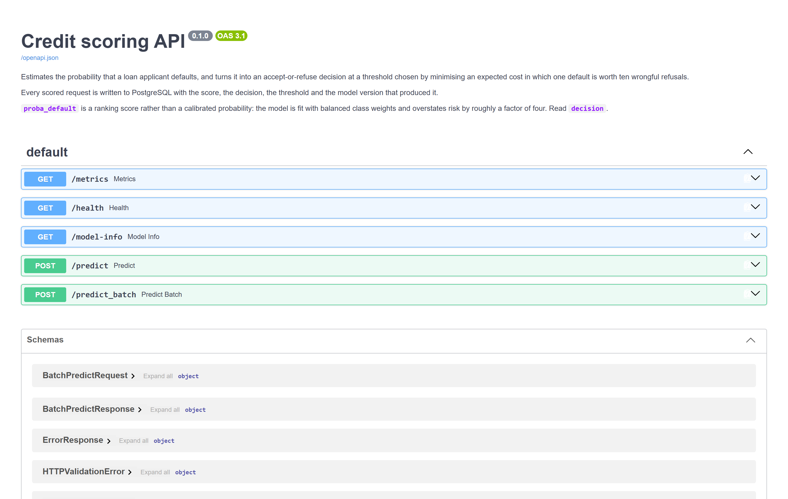

Every prediction is written to PostgreSQL: the payload, the score, the decision, the model
version, the latency. [`docs/DB.md`](docs/DB.md) says what that table is for and which of its
columns are allowed to be empty.

<!-- source: docs/images/MANIFEST.json -->
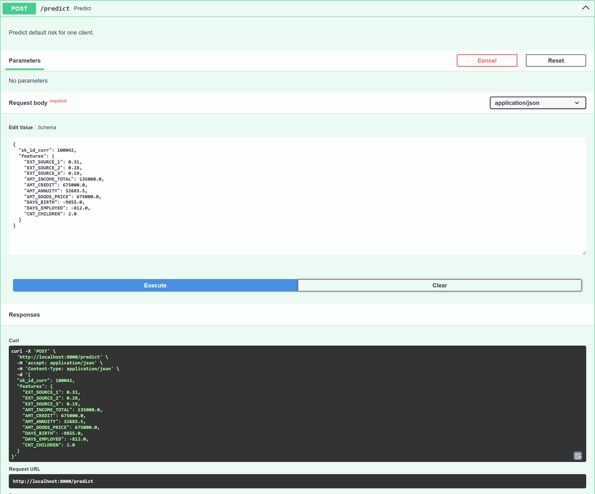

A **Streamlit** interface sits on top for people who will not send JSON by hand. Its second
page reads the log back with **Plotly**: what has been decided lately, at what latency, and how
the threshold split the traffic. [`docs/interface.md`](docs/interface.md) says what both pages
show, and how to ask the API the same questions from a terminal.

<!-- source: docs/images/MANIFEST.json -->
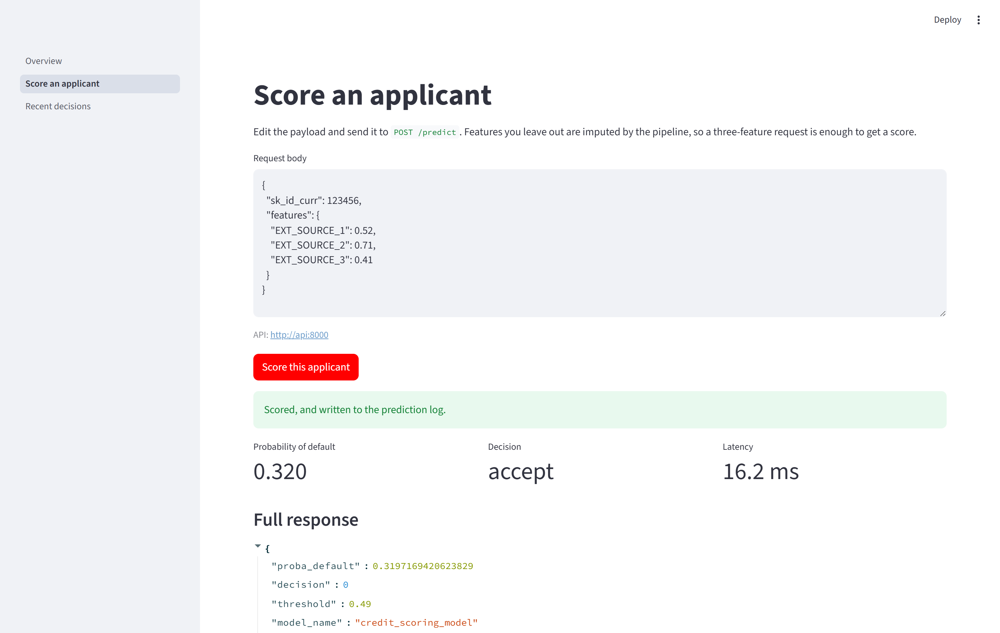

<!-- source: docs/images/MANIFEST.json -->
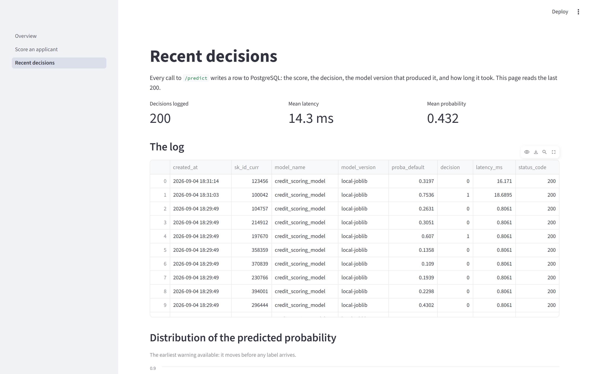

**Prometheus** scrapes the API and **Grafana** draws it. Both the data source and the
dashboard are provisioned from `infra/grafana/`, so the dashboard belongs to the repository and
not to one person's browser. **Evidently** watches the traffic itself, and **Docker** ships all
of it.

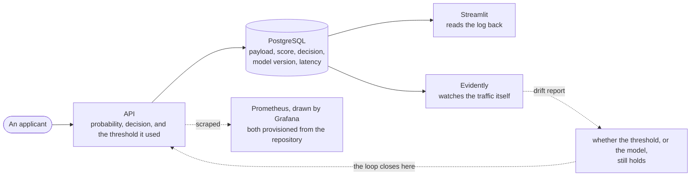

<!-- source: docs/images/MANIFEST.json -->
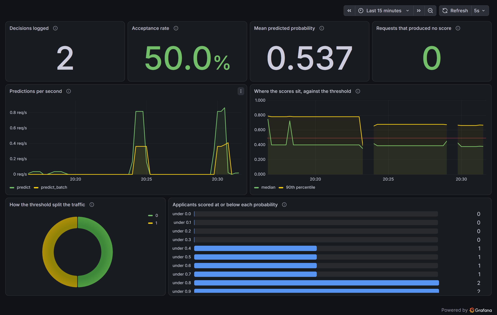

### How it is built

The model is **LightGBM** on a feature matrix of 796 columns, joined from the seven tables
with **pandas** and kept as **Parquet**. **scikit-learn** holds the pipeline and
**imbalanced-learn** its resampling step, **MLflow** tracked the training runs and **Optuna**
tuned them. **FastAPI** serves the frozen artefact and **Uvicorn** runs it, with **PostgreSQL**
behind the prediction log and **SQLAlchemy** mapping it. **SHAP** explains one decision, and
**ONNX** Runtime was measured against the pipeline and left out of it.

Three choices worth defending:

**Preprocessing lives inside the pipeline, not before it.** Imputation and scaling are steps
of the `Pipeline`, fitted inside each fold. `credexp.modeling.pipelines` says what that
prevents, and it is the reason published scores on this dataset are often optimistic.

**A frozen artefact backs the API, and no registry call.** MLflow tracked the experiments and
is deliberately absent from the request path; `credexp.serving.model_loader` says what that
buys and what it costs.

**The artefact carries a manifest.** `model_manifest.json` is written by the final training and
read by the loader: the feature columns and their schema version, the threshold and how it was
chosen, the hyper-parameters and the tuning trial they came from, the imbalance strategy, a
fingerprint of the training data, and the commit. The hyper-parameters used to be copied into
the training script by hand, which meant the final model depended on a result no file connected
it to. They are read from the tracked trials now, and a missing artefact stops the run.

## The result

<!-- source: models/threshold.json -->
The threshold is chosen by minimising an expected cost in which one default costs ten times
what one wrongly refused applicant costs. **The shipped value is 0.49**, and it refuses 27 % of
n = 30 751 applicants.

A cost per applicant means nothing without something to compare it to, so the trivial policies
are in the table:

<!-- source: reports/decision/decision_analysis.json -->
| Policy | n | cost_per_row |
|---|---|---|
| refuse everyone | 30 751 | 0.9193 |
| random at the base rate | 30 751 | 0.8170 |
| accept everyone | 30 751 | 0.8075 |
| **the model, at threshold 0.49** | 30 751 | **0.4888** |

> **How to read it.** Each row is a decision policy applied to the same applicants, and
> `cost_per_row` is what it loses on average per applicant under the assumed prices: one unit
> for someone wrongly refused, ten for a default let through, nothing for a correct call. Lower
> is better. The three rows above the model need no model at all, which is what makes the last
> row's distance from them the measure of what learning bought.

Refusing everyone is a serious policy at this cost ratio, which is exactly why it belongs in
the table; `credexp.modeling.baselines` says why the three were chosen. The model roughly
halves the cost of the best of them.

<!-- source: reports/decision/decision_analysis.json -->
**The interval on that cost runs from 0.4721 to 0.5068**, the middle 95 % of n = 1000 bootstrap
resamples of the holdout. The threshold does not move while the applicants are resampled, and
`credexp.modeling.sensitivity` says what the alternative would have produced.

### What learning was worth, and what the family was worth

Two questions the cost table above cannot separate: how much of that gain comes from learning
anything at all, and how much from learning it with trees.

<!-- source: reports/model_comparison.csv -->
| model | variant | n | roc_auc_mean | pr_auc_mean | business_cost_per_row |
|---|---|---|---|---|---|
| dummy | most_frequent | 30 751 | 0.5000 | 0.0807 | 0.8075 |
| dummy | stratified | 30 751 | 0.5071 | 0.0821 | 0.8050 |
| lr | | 30 751 | 0.7348 | 0.2238 | 0.5623 |
| **lgbm** | | 30 751 | **0.7433** | **0.2324** | **0.5472** |

> **How to read it.** One row per model family, all cross-validated on the same holdout.
> ROC AUC (area under the receiver operating characteristic curve) answers one question: set a
> future defaulter beside somebody who repaid, and how often does the model order the pair
> correctly? It says nothing about where the threshold should sit. PR AUC
> (area under the precision-recall curve) is the one to read on a population where few people
> default, because its floor is the default rate itself. `business_cost_per_row` prices the same
> decisions out of sample, before any threshold has been tuned.

Learning at all is worth 0.24 per applicant. Choosing gradient-boosted trees over a logistic
regression is worth 0.015, sixteen times less. Notebook 03 reads the same table and says what
that ratio means for a feature set of 796 engineered columns.

Five-fold cross-validation on the holdout, so the absolute costs sit above the 0.4888 above:
the frame is a tenth of what the shipped model saw. `uv run python scripts/compare_models.py`
rebuilds the table, and its header says why that frame.

### What the whole thing rests on

<!-- source: reports/figures/MANIFEST.json -->
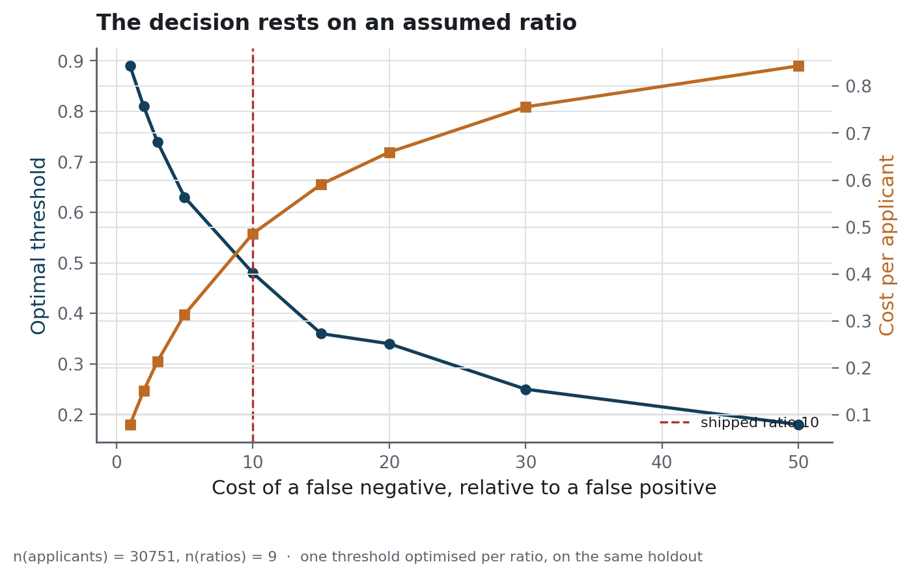

> **How to read it.** The horizontal axis carries the assumption this whole page rests on: how
> much a default costs relative to a wrongly refused applicant. Two series share it. The blue
> line, read on the left axis, is the threshold that minimises expected cost at each assumption;
> the orange line, read on the right axis, is what the resulting decision costs per applicant.
> The dashed marker is the ratio this repository assumes. The blue line crosses most of its own
> range, so the assumption decides more than the model does.

<!-- source: reports/decision/decision_analysis.json -->
Ten to one is an assumption. It was not measured, and over the n = 9 ratios swept the optimal
threshold runs from **0.89** if a default costs the same as a wrongful refusal to **0.18** if it
costs fifty times as much. The decision sweeps the entire usable range on the strength of that
one number.

This is the figure to look at before any other. Everything above is conditional on a ratio that
whoever bears the loss would have to supply, and the honest form of the result is "0.4888 per
applicant, *given* ten to one".

### Who it refuses

<!-- source: reports/decision/decision_analysis.json -->
| Group | n | default_rate | refusal_rate | fnr |
|---|---|---|---|---|
| under 30 | 4 349 | 0.1122 | **0.4842** | 0.2111 |
| 30-39 | 8 144 | 0.0933 | 0.3396 | 0.2539 |
| 40-49 | 7 773 | 0.0783 | 0.2579 | 0.3268 |
| 50-59 | 6 844 | 0.0646 | 0.1940 | 0.4570 |
| 60 and over | 3 641 | 0.0505 | **0.1247** | **0.5870** |
| men | 10 371 | 0.1030 | 0.3781 | 0.2425 |
| women | 20 380 | 0.0694 | 0.2325 | 0.3859 |

> **How to read it.** One row per group of applicants. `default_rate` is the share of the group
> who did default, measured and not predicted, and it is the denominator the other two columns
> are read against. `refusal_rate` is the share the shipped threshold turns down. `fnr` is the
> false negative rate, the share of that group's own defaulters the threshold let through. Low
> refusal beside a high false negative rate means a group is trusted more than its record
> supports.

<!-- source: reports/decision/decision_analysis.json -->
Over n = 4349 applicants under thirty the refusal rate is **0.4842**; over n = 3641 applicants
of sixty and over it is **0.1247**. Part of that follows real risk, a default rate of 0.1122
against 0.0505. Not all of it does, and the mirror image is the uncomfortable half: among
applicants over sixty the model misses **0.587** of those who default. Low refusal and poor
detection are the same fact seen twice.

<!-- source: reports/figures/MANIFEST.json -->
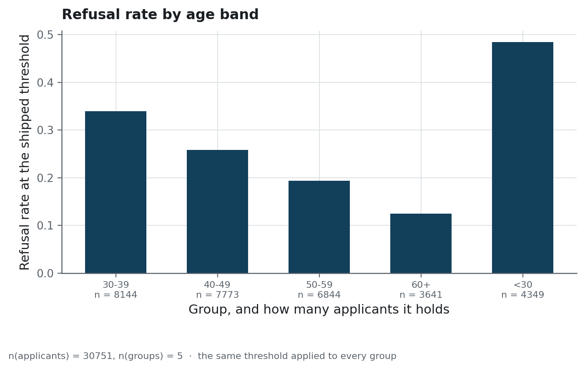

> **How to read it.** One bar per age band, its height the share of that band the shipped
> threshold refuses, with the population of the band written underneath. The bands run in age
> order and not in height order, so a steady slope is a real gradient and a jagged one would not
> be. Set each bar against the same band's default rate in the table above: the distance between
> the two is what the threshold adds to the risk the group already carries.

Nothing here is corrected. Adjusting a credit model for fairness commits to a definition of
fairness, and several reasonable definitions are mutually exclusive: equal refusal rates and
equal error rates cannot both hold when the base rates differ. That is a decision for whoever
owns the lending policy, and taking it in passing would be worse than naming it.

`uv run python scripts/decision_analysis.py` reproduces every number in this section, and they
land in `reports/decision/`.

### What the model is looking at

<!-- source: reports/figures/MANIFEST.json -->
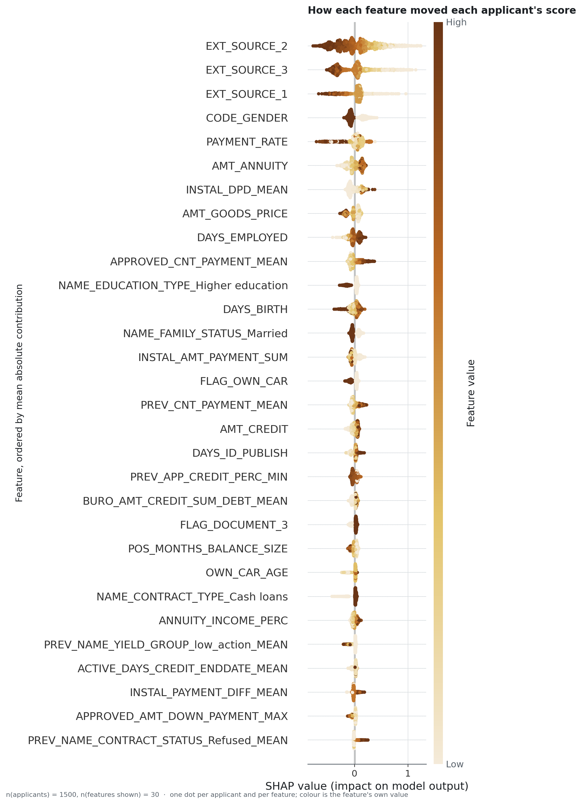

> **How to read it.** One row per feature, ordered by how much it moves scores overall. Each dot
> is one applicant: its position says how far that feature pushed that person's score, right for
> up and left for down, and its shade says whether that person's own value for the feature was
> high or low. SHAP (SHapley Additive exPlanations) splits a single prediction into one
> contribution per feature, so a wide row is a feature that decides a great deal for somebody.

Three external credit-bureau scores carry most of the decision, and after them comes the loan's
own arithmetic: the annuity, the payment rate, the goods price. That ordering is worth having
for two reasons.

The first is that **no single feature dwarfs the rest**, which is the smell that usually means a
leak on this dataset. Had one column separated defaulters on its own, it would have been a
symptom of the outcome rather than a predictor of it.

The second is less comfortable: **`CODE_GENDER` is the fourth strongest feature.** The refusal
gap in the table above is not an accident of correlation, it is something the model reads
directly. Nothing is corrected, for the reasons given there, and the figure is what makes the
gap traceable.

A single applicant decomposes the same way:

<!-- source: reports/figures/MANIFEST.json -->
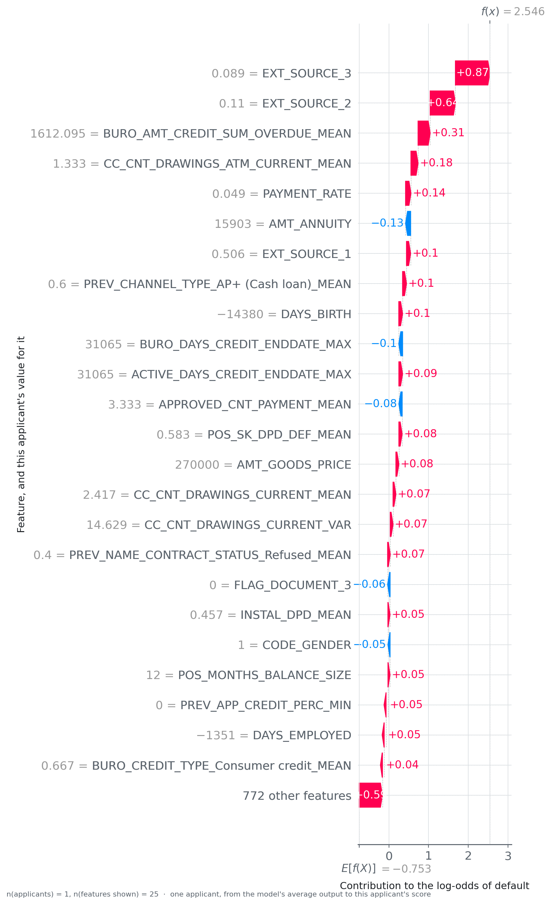

> **How to read it.** A single applicant, one row per feature, with that person's own value
> printed beside the feature name. Each bar is the push that feature gave, in log-odds, which is
> the scale the model adds up on before anything is turned into a probability. Bars reaching
> right raise the risk and bars reaching left lower it. Begin at the model's average output, add
> every bar, and the total is the score this applicant received.

<!-- source: reports/explainability/explainability_meta.json -->
The model's average output is a log-odds of **-0.753**, computed over the n = 5000 background
sample; the applicant drawn above is the highest-risk of the n = 1500 explained. Two bureau
scores near zero carry most of the distance between the two. That is the shape of the
explanation a refused applicant is owed.

`uv run python scripts/explainability.py` regenerates all four figures from the frozen artefact.

## Why these numbers can be believed

Four things about them were checked rather than asserted, and two of the four came back wrong.

<!-- source: reports/decision/decision_analysis.json -->
**The threshold used to be tuned and scored on the same data.** Measured on the two halves of
the n = 30751 holdout, that shortcut is worth **0.0029** per applicant against a cost near 0.49.
Real, small, and free to remove. `credexp.modeling.train` holds the rule that replaced it.

<!-- source: reports/decision/decision_analysis.json -->
**The shipped threshold was calibrated on a model trained on part of the development set and
then applied to one refit on all of it.** Against the n = 30751 holdout's own optimum of
**0.48**, the shipped **0.49** costs **0.0028** more per applicant. The compromise survives
measurement, which is more than an argument for it would.

<!-- source: reports/performance/calibration.json -->
**The threshold is a decision, not a coincidence.** Reselected on n = 25 resamples of half the
holdout, it lands at a median of 0.50 with a 95 % interval of **[0.47, 0.544]**, and the shipped
value sits inside it. Worth checking precisely because it could have gone the other way: a
threshold whose interval spanned 0.3 to 0.7 would be one draw among many presented as a
decision, and 27 % of applicants are refused at the current one.

**The returned probability is not a probability.** Measured on the n = 30 751 holdout:

<!-- source: reports/performance/calibration.json -->
| | n | mean_score | brier | ece |
|---|---|---|---|---|
| as served | 30 751 | 0.3656 | 0.1650 | **0.2867** |
| after isotonic recalibration | 30 751 | 0.0815 | 0.0639 | **0.0060** |
| the true base rate | 30 751 | 0.0788 | | |

> **How to read it.** Each row is the same holdout scored a different way. `mean_score` is the
> average probability handed back, and the last row gives the rate it should be compared with.
> `brier` is the mean squared distance between a returned probability and what actually
> happened, so it rewards ranking well and being honest about the scale at once. `ece` is the
> expected calibration error, the average gap between what was promised and what occurred.

<!-- source: reports/performance/calibration.json -->
Over the n = 30751 holdout the model overstates default risk across the whole range: a mean
score of **0.3656** against a base rate of **0.0788**, which is a factor of nearly five. This is the price of
`class_weight="balanced"` and not a defect: reweighting the classes buys ranking quality and
destroys the probability scale. ROC AUC cannot see it, because multiplying every score by a
constant reorders nothing.

<!-- source: reports/figures/MANIFEST.json -->
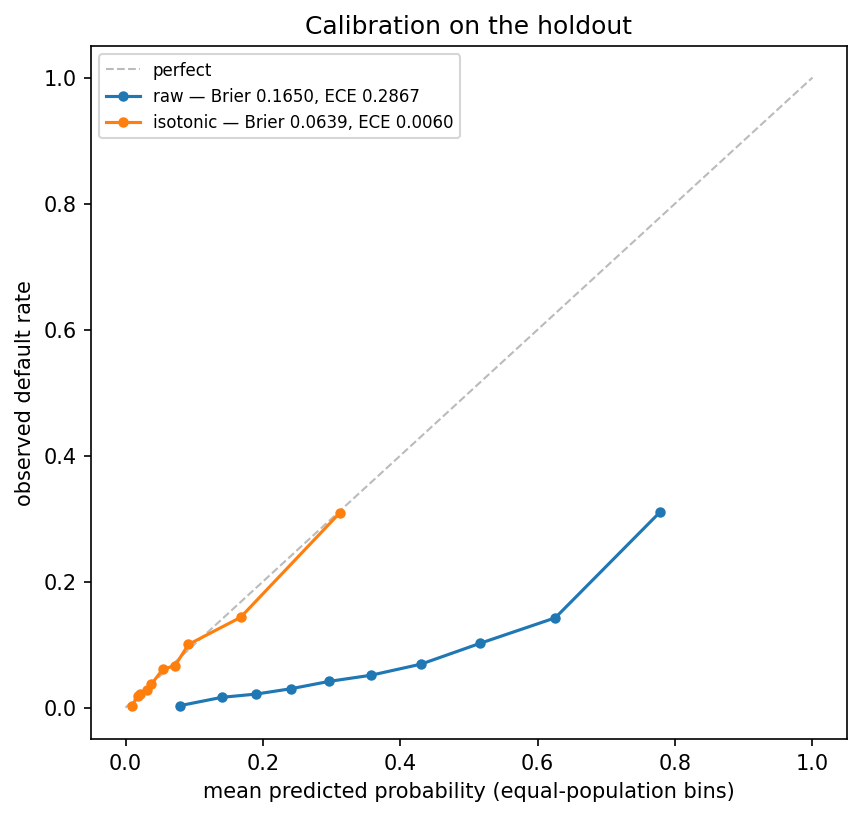

> **How to read it.** Every applicant of the holdout falls into one of ten bins holding the same
> number of people, ranked by the probability the model handed them. A bin's position across the
> chart is the probability it was promised; its height is the share of it that defaulted. The
> diagonal is where those two agree. A curve running below the diagonal along its whole length
> is a model claiming more risk than it goes on to find.

Isotonic recalibration, fitted on half the holdout and measured on the other half, removes
almost all of it. Shipping it properly means fitting the calibrator during training, on the
validation split, and recording it in the manifest, with the threshold mapped through the same
monotone function so that no decision changes: isotonic regression cannot reorder a pair, only
merge two. That needs a training run on the full feature matrix, which is not shipped here.
**Until then the field to read is `decision`. `proba_default` is a score, and not a
probability.** `uv run python scripts/calibration_report.py` reproduces the table and the figure.

### Where a leak would come from, and why there is not one

The per-customer aggregations are the usual risk on this dataset, and they are safe here for a
reason [`docs/data-source.md`](docs/data-source.md) states in full: each one looks only at the
applicant's own past. Nothing is aggregated across applicants, and nothing reaches forward in
time.

Two places would need care if this were extended. **A feature built from an outcome**: nothing
here touches `TARGET` outside the label itself, but a "number of previous defaults" aggregate
drawn from the wrong table would, and it would look like an ordinary count. And **preprocessing
fit outside the fold**, handled by construction above, worth naming because it is the leak that
most often survives a review here.

The check that would catch a regression is a smell more than a test: one feature whose
importance dwarfs every other. None does here.

### What the tests assert

Not that the code runs. That what is published is true:

- the decision tables under `reports/decision/` re-derive from each other: the markdown a
  reader sees is what the renderer produces from the JSON beside it, byte for byte;
- the shipped threshold is the same number in `models/threshold.json` and in the analysis;
- every baseline costs more than the model, and the confidence interval contains its own
  point estimate;
- the service answers with no database behind it, which is what « the prediction log is best
  effort » means when it is true;
- a request that names two features is scored on all 796, in the fitted order, and a frame
  whose columns were permuted is refused rather than scored.

193 tests in three tiers, read by `pytest`: unit, integration, and one outer tier that starts
`uvicorn` in its own process and questions it over HTTP. That tier is what found a service
taking two minutes to answer when PostgreSQL was unreachable.

## Running it

```bash
cp .env.example .env
uv sync --all-groups
docker compose up -d          # API, Streamlit, PostgreSQL, Prometheus, Grafana
```

The API answers on `:8000` with its documentation at `/docs`, Streamlit on `:8501`, and the
provisioned dashboard on `:3000`. Nothing has been scored yet, so the dashboard opens empty;
give it traffic:

```bash
uv run python scripts/send_sample_traffic.py --requests 300
```

Drift is measured on the **raw API input** and not on the engineered columns.
`credexp.monitoring.drift` says what that level catches, and
[`docs/operations.md`](docs/operations.md) says what the two frames are.

```bash
uv run python scripts/build_drift_reference.py   # writes var/data/processed/reference.parquet
uv run python scripts/monitoring_drift.py        # writes reports/monitoring/
```

Only the first of the two is watched here, and the report is generated on demand. A scheduled
job with no one on the other end of it eventually turns red on its own, and is then trusted less
than no job at all.

<!-- source: docs/images/MANIFEST.json -->
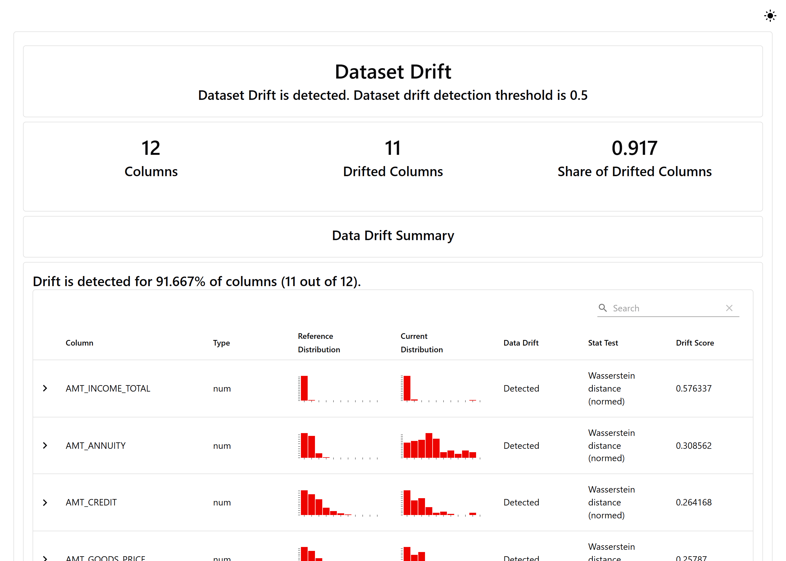

The decision analysis needs the holdout, which is **not versioned**. Rebuild it from the raw
Kaggle tables with `scripts/build_features.py`, then run `scripts/train_final.py` and
`scripts/decision_analysis.py`.

Six documents stand behind this page. [`architecture`](docs/architecture.md) draws the
boundaries. [`protocol`](docs/protocol.md) measures. [`data-source`](docs/data-source.md) says
what may be published. [`DB`](docs/DB.md) is the log's schema.
[`interface`](docs/interface.md) covers both pages and the `curl` calls under them.
[`operations`](docs/operations.md) is the runbook. The seven notebooks under
[`notebooks/`](notebooks/) run in the order the work was done: the join, the exploration, the
family comparison, the tuning study, the explanations, the drift watch, the benchmarks.

## Structure

```
├── models/     the frozen serving artefacts: pipeline, columns, threshold
├── reports/    every published number and figure, each written by a script
├── src/        the package: data, modeling, monitoring, serving, app
├── scripts/    thin entry points that read arguments and call the package
├── infra/      the images, the compose file, the Grafana and Prometheus provisioning
├── notebooks/  the work in the order it was done
├── docs/       five documents and the screenshots
├── tests/      unit, integration, system
└── var/        everything a run leaves behind, and the Kaggle download
```

## What this does not prove

**The cost ratio is assumed, not measured.** Ten to one came from the domain, not from this
lender's books. Everything downstream of it moves with it, and the sensitivity figure is how
much.

**The probability scale is wrong, and knowingly so.** See above. The decision is not affected;
any downstream use of `proba_default` as a probability would be.

**The fairness gaps are published and untouched.** See above.

**The comparison is on the holdout.** The family table is five-fold cross-validation on 30 751
applicants, a tenth of the development set, because that is the only frame this repository can
put in front of a reader. The ordering is stable across folds; the absolute costs are not the
shipped ones.

**No drift has actually been observed.** The traffic the monitor reads is the holdout replayed
through the API, so the comparison is a sample of the training population against a sample of
itself. Every part of the mechanism runs; nothing has yet moved under it.

## Licence and data

Code under [MIT](LICENSE).

The Home Credit Default Risk data is **not redistributed**: it remains subject to the
competition's terms and must be obtained from Kaggle. Nothing under `var/data/` is versioned,
and every figure above reproduces from the scripts once the raw tables are in place. The three
artefacts under `models/` are 4 MB of fitted weights, which are this repository's own work and
carry no third-party licence.
