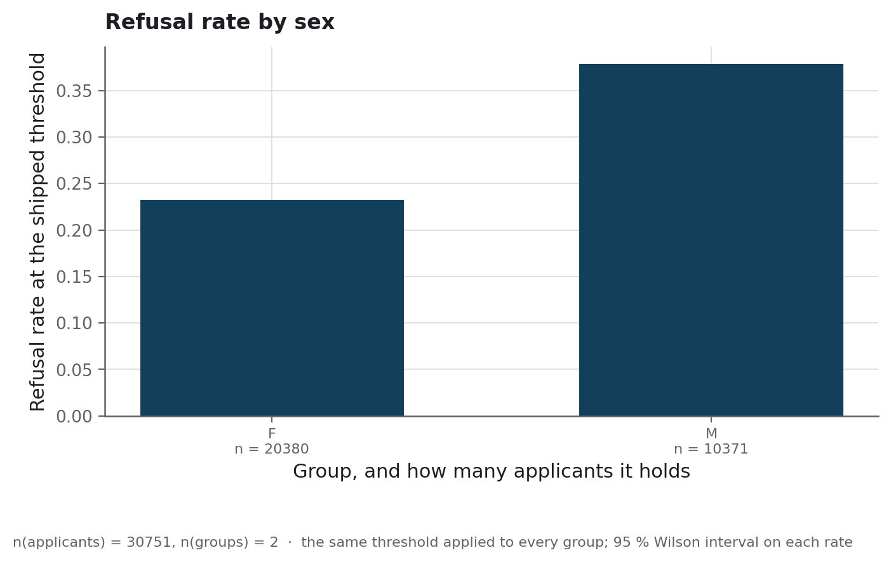

# Running it

Start the stack, give it traffic, and know what to look at when something stops answering.

## Starting it

```bash
cp .env.example .env
docker compose up -d          # API :8000, Streamlit :8501, PostgreSQL, Prometheus, Grafana :3000
```

Five containers, one image for the API and the interface. The model is the three files under
`models/`, copied into the image and loaded once at startup.

Without Docker:

```bash
uv sync --all-groups
uv run python scripts/init_db.py                 # once, against a reachable PostgreSQL
uv run python scripts/run_api.py                 # http://127.0.0.1:8000/docs
uv run streamlit run src/credexp/app/Overview.py # http://127.0.0.1:8501
```

## What changes what

| Variable | Default | What it changes |
|---|---|---|
| `MODEL_LOAD_MODE` | `auto` | `joblib` reads `models/`; `mlflow` resolves a registered version |
| `MODEL_JOBLIB_PATH` | `models/pipeline.joblib` | the artefact to serve |
| `THRESHOLD_PATH` | `models/threshold.json` | the operating point |
| `FEATURE_COLUMNS_PATH` | `models/feature_columns.json` | the column order the pipeline was fitted on |
| `DATABASE_URL` | a local PostgreSQL | where the prediction log is written |
| `DB_CONNECT_TIMEOUT` | `3` | how long a missing database may delay a startup |
| `API_ROOT_PATH` | empty | the prefix, when the service is behind a reverse proxy |
| `PROMETHEUS_ENABLED` | `true` | whether `/metrics` is exposed |
| `API_BASE_URL` | `http://127.0.0.1:8000` | where the interface looks for the service |

`.env.example` carries the full list with what each one is for.

## The two probes, and which one to wire where

| Route | Answers | A failure means |
|---|---|---|
| `/health` | the process is up | restart it |
| `/ready` | a model is loaded and it can predict | stop sending it traffic |

The container's `HEALTHCHECK` is wired to the first. Wired to the second, a container that has
not finished loading its model would be killed before it ever could.

## Giving it traffic, and watching it

```bash
uv run python scripts/send_sample_traffic.py --requests 300
```

The dashboard at `:3000` is provisioned from `infra/grafana/`: the data source, the panels
and the queries are files in this repository, so the dashboard is not one person's browser
state.

<!-- source: docs/images/MANIFEST.json -->


What `/metrics` exposes, beyond the HTTP histogram the instrumentator adds:

| Metric | What it counts |
|---|---|
| `credexp_predictions_total` | scored requests, by decision |
| `credexp_default_probability` | the distribution of the returned scores |
| `credexp_threshold_crossings_total` | how often the score crossed the threshold |
| `credexp_prediction_failures_total` | failures, by kind |

## Watching the traffic itself

```bash
uv run python scripts/build_drift_reference.py   # var/data/processed/reference.parquet
uv run python scripts/monitoring_drift.py        # reports/monitoring/
```

Two frames go into the comparison: a fixed sample of the training population, written once by
the first command, and whatever the service has been sent since, rebuilt from the log by the
second. Both are raw payloads. `credexp.monitoring.drift` says what that level of measurement
can and cannot see.

## What the decisions look like by group

The README publishes the age bands and the sexes as one table. The second of the two figures
is here because it is an operating fact rather than a result: the same threshold, applied to
two populations with different base rates, refuses them at different rates.

<!-- source: reports/figures/MANIFEST.json -->


> **How to read it.** Two bars, one per group, each the share of that group the shipped
> threshold says no to, with the group's size printed below it. The comparison that counts is
> against each group's own default rate, which the fairness table of the README carries. A
> refusal rate sitting above the rate at which a group actually defaults is the part that no
> difference in risk explains.

## When something stops answering

| Symptom | What it is | What to do |
|---|---|---|
| `/ready` returns 503 | no model loaded | check `MODEL_LOAD_MODE` and that `models/` reached the image |
| Every prediction is 200 but the log is empty | the database is unreachable | the log is best effort; check `DATABASE_URL`, then `docker compose logs db` |
| The service takes seconds to start | the database is unreachable and the deadline is waiting | expected: `DB_CONNECT_TIMEOUT` bounds it at three seconds |
| A prediction returns 422 | a field name is not a feature, or `features` is empty | the response says which; the contract is `extra="forbid"` |
| The dashboard is empty | nothing has been scored yet | `scripts/send_sample_traffic.py` |
| The drift report is empty | the log holds no successful request | give it traffic first |

## The deployment that was

`infra/huggingface/` holds the Dockerfile, the nginx configuration and
[the Space card](../infra/huggingface/README.md) of a Hugging Face deployment that is
decommissioned. The workflow that pushed it,
`.github/workflows/deploy_huggingface.yml`, is manual-only for that reason. Both are kept
because they document how the deployment worked, and neither runs.
