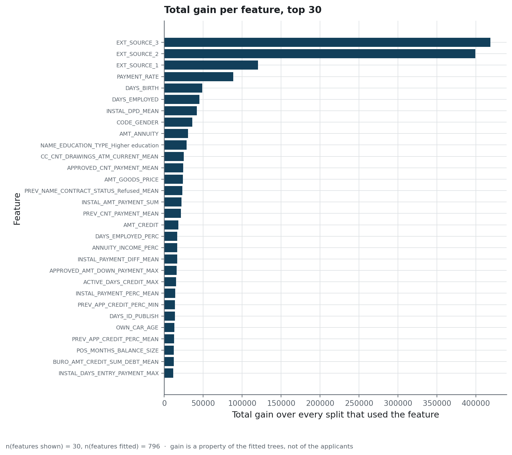
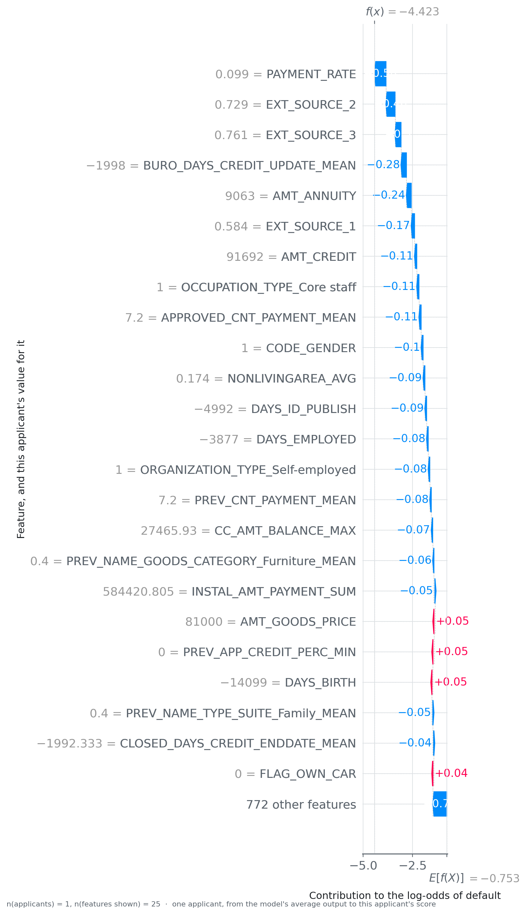

# How each number was measured

Every label of every published table is defined in `metrics.yaml`. What follows is the
protocol behind those tables: which applicants, which split, and what each number may be read
as claiming.

## The three populations

<!-- source: docs/data-source.md -->
| Frame | n | What it is | Where it lives |
|---|---|---|---|
| development set | 276 760 | what the shipped model was fitted on | not in this repository |
| holdout | 30 751 | never seen during fitting, and where every published number is measured | `var/data/processed/api_holdout.parquet` |
| unlabelled | 48 744 | the Kaggle test split, which carries no target | not used here |

The split is by row, made once in `scripts/train_final.py`, stratified on the target. Nothing
published below is measured on the development set.

## What is held fixed, and what varies

| Held fixed | Varied, and measured |
|---|---|
| The 796 columns, and the order `models/feature_columns.json` records | the **model family**, in `reports/model_comparison.csv` |
| The cost ratio of ten to one | the **assumed ratio**, in the sensitivity sweep |
| The holdout | the **threshold**, reselected on resamples |
| The random state, 42 | the **resample**, for every interval published |

## The cost, and why it is the objective

One wrongly refused applicant costs 1. One missed default costs 10. Every cost published is
the average of that quantity per applicant scored. It is not money: nobody measured what a
default costs this lender, and `reports/figures/cost_sensitivity.png` is what the assumption
moves. The honest form of every result on this page ends with « given ten to one ».

## How the threshold is chosen

1. `scripts/tune_optuna.py` runs thirty trials on the shipped family, with the cost as the
   objective, and writes `reports/tuning/optuna_trials.csv`.
2. `scripts/train_final.py` reads the best completed trial **from that file**, fits on the
   development set, and sweeps the threshold on a validation split to minimise the cost.
3. The chosen value, the two costs it rests on and the selection rule go to
   `models/threshold.json` and into the manifest.
4. `scripts/decision_analysis.py` re-measures everything on the holdout, which is the table
   the README publishes.

**No fold both picks and scores its own operating point.** The cycling rule is written out in
`credexp.modeling.train`, and what it replaced is published as `optimism`: 0.0029 per applicant,
measured on the two halves of the holdout.

## What is measured with an interval, and what is not

| Number | Interval | Over what |
|---|---|---|
| cost per applicant | 0.4721 to 0.5068 | 1 000 bootstrap resamples of the holdout, threshold fixed |
| the threshold itself | [0.47, 0.544] | 25 resamples of half the holdout, reselected on each |
| everything else | none published | the group sizes are in the tables |

The threshold is held fixed while the cost is resampled, on purpose: resampling and
re-optimising at once mixes two sources of variation into an interval nobody can interpret.
The threshold's own spread is measured separately, and that is the pair to read together.

## The family comparison

`scripts/compare_models.py` cross-validates four families on five stratified folds of the
holdout: two trivial baselines, a logistic regression, and the gradient-boosted trees that
are shipped. It runs on the holdout because the development set is not redistributable, so
the absolute costs sit above the shipped 0.4888. What survives the change of sample is the
ordering, and that is what a family comparison is for.

<!-- source: reports/figures/MANIFEST.json -->

Gain is a property of the fitted trees rather than of the applicants: two correlated columns
share the credit between them arbitrarily. The SHAP figures in the README answer the other
question, on the applicants themselves, and the lowest-risk applicant of the sample decomposes
the same way as the highest:

<!-- source: reports/figures/MANIFEST.json -->

## What a retraining loop would need

Nothing here retrains, and the three things missing are worth naming rather than half-built:
a labelled outcome arriving months after the decision, a calibrator fitted during training on
the validation split with the threshold mapped through it, and a drift signal on the
engineered features and not only on the raw payloads. `docs/operations.md` says what is
watched today.
